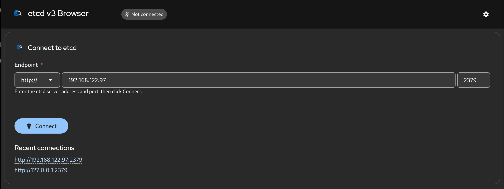
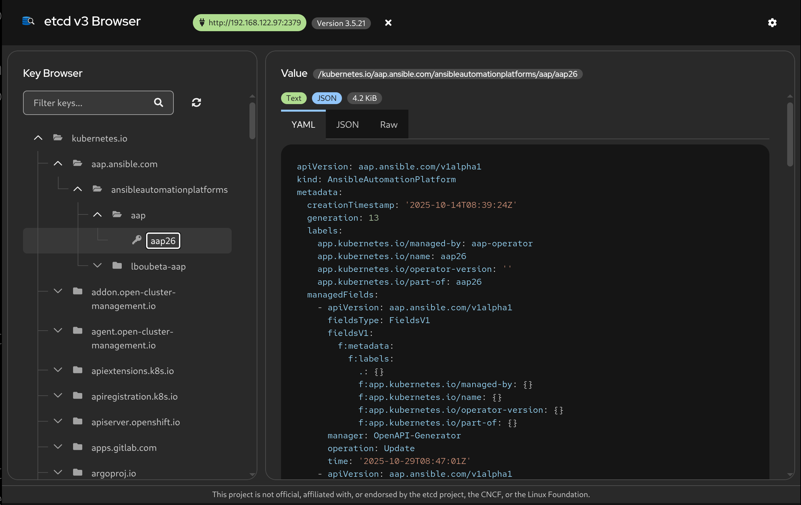

# etcd v3 Browser

A web UI for browsing [etcd](https://etcd.io) v3 key-value data. Built with
[PatternFly 6](https://www.patternfly.org/), React 19, and Node.js 20.

Connect to any etcd endpoint from the browser, explore keys in a lazy-loaded
tree, and inspect values as text, JSON, YAML, hex, or decoded Kubernetes /
OpenShift API objects.

> **Disclaimer:** This project is **not** official, affiliated with, or endorsed by the
> [etcd project](https://etcd.io), the [Cloud Native Computing Foundation (CNCF)](https://www.cncf.io/),
> the [Linux Foundation](https://www.linuxfoundation.org/), Kubernetes, or OpenShift.
> "etcd" is a registered trademark of The Linux Foundation. This tool is an
> independent, community-built utility.

**New here?** Follow the step-by-step guide in [docs/quickstart.md](docs/quickstart.md).

## Screenshots

### Connect to etcd

Enter the server protocol, host, and port, then click **Connect**. An optional default
endpoint can be pre-filled from `ETCD_HOSTS`.



### Browse keys and values

After connecting, use the key tree to explore `kubernetes.io`, `openshift.io`, and other
prefixes. Select a key to view its value as text, JSON, YAML, hex, or a decoded
Kubernetes / OpenShift resource.



## Features

| Area | Capability |
|------|------------|
| **Connection** | Choose protocol, host, and port in the UI; optional default from `ETCD_HOSTS`; recent endpoints stored in the browser |
| **Key browser** | PatternFly tree view with lazy loading, search filter, refresh, folder click to expand/collapse |
| **Text values** | Detect JSON; tabs **YAML**, **JSON**, **Raw** with syntax highlighting |
| **Binary values** | Base64 and hex dump; **YAML** / **JSON** when decoded as Kubernetes or OpenShift protobuf resources |
| **Decoding** | `kubernetes.io` and `openshift.io` etcd encodings (`k8s\x00` + `runtime.Unknown` envelope) |
| **TLS** | Optional CA and client certificates for mTLS (env vars or Helm-mounted secrets) |
| **UI** | Light / dark / system theme; custom etcd-style logo and favicon; viewport-fitted layout with independent panel scrolling |
| **Deploy** | Multi-stage UBI 9 container (non-root), Helm chart, hack scripts for local dev |

## Project structure

```
.
├── LICENSE                 # Apache License 2.0
├── NOTICE                  # Attribution and third-party notices
├── images/                 # Screenshots (connect, browse)
├── docs/
│   ├── quickstart.md       # Step-by-step guide for new users
│   ├── DEVELOPMENT.md      # Local dev, protos, module map
│   └── LICENSE-COMPLIANCE.md
├── src/
│   ├── server.js           # Express entry point
│   ├── config.js           # Port, TLS paths, client pool, static dir
│   ├── package.json        # Backend dependencies
│   ├── routes/api.js       # REST API
│   ├── middleware/         # Endpoint validation
│   ├── services/
│   │   ├── etcd-client.js  # etcd3 connection pool (LRU)
│   │   ├── value-decoder.js
│   │   ├── k8s-decoder.js
│   │   └── openshift-decoder.js
│   ├── lib/                # Generic protobuf helpers
│   ├── protos/             # Vendored K8s / OpenShift .proto schemas
│   └── frontend/           # React + TypeScript SPA
│       ├── public/         # index.html, logos, manifest
│       └── src/            # App.tsx, theme, syntax highlighting
├── container/
│   └── Containerfile       # Multi-stage UBI 9 build
├── chart/etcd-v3-browser/  # Helm chart
└── hack/
    ├── run-local.sh
    ├── run-container.sh
    ├── seed-etcd.sh
    ├── download-k8s-protos.sh
    └── download-openshift-protos.sh
```

## Architecture

A single Node.js process serves the built React app and proxies etcd over gRPC:

```text
Browser  →  Express (static + /api/*)  →  etcd3 client pool  →  etcd cluster
```

- **Backend:** Modular Express router; each API call passes `?endpoint=` (or uses
  server default from `ETCD_HOSTS`). Connections are cached and reaped after idle TTL.
- **Frontend:** PatternFly `TreeView`; expanding a folder fetches only direct children.
  Value rendering uses `prism-react-renderer` for JSON/YAML.

### Protobuf decoding

Binary values prefixed with `k8s\x00` are decoded using Kubernetes
`runtime.Unknown`, then the inner type:

- **Kubernetes API groups** — schemas under `src/protos/k8s.io/` (e.g. `apps/v1`,
  `core/v1`, `rbac.authorization.k8s.io/v1`).
- **OpenShift API groups** — schemas under `src/protos/openshift.io/api/` (e.g.
  `route.openshift.io/v1`, `project.openshift.io/v1`).

Download or refresh schemas before building the container:

```bash
./hack/download-k8s-protos.sh          # required
./hack/download-openshift-protos.sh    # after k8s protos (imports k8s.io)
```

Optional release pin: `./hack/download-k8s-protos.sh v1.32.0`

## API reference

All etcd operations require `endpoint` as a query parameter (URL-encoded), except
`/api/config`.

| Method | Path | Query / body | Description |
|--------|------|----------------|-------------|
| `GET` | `/api/config` | — | `{ defaultEndpoint }` from `ETCD_HOSTS` (may be empty) |
| `GET` | `/api/connect` | `endpoint` | Test connection; returns version and db size |
| `GET` | `/api/keys` | `endpoint`, `prefix` | One tree level under `prefix` |
| `GET` | `/api/key` | `endpoint`, `key` | Value + encoding + optional decoded resource |
| `PUT` | `/api/key` | `endpoint`, body `{ key, value }` | Write a key |
| `DELETE` | `/api/key` | `endpoint`, `key` | Delete a key |
| `GET` | `/readyz` | — | Readiness (HTTP 200, `{ status: "ok" }`) |

Example (after starting the server):

```bash
EP='https://192.168.122.97:2379'
curl -s "http://localhost:3001/api/connect?endpoint=$(python3 -c "import urllib.parse; print(urllib.parse.quote('$EP'))")"
curl -s "http://localhost:3001/api/keys?endpoint=...&prefix="
curl -s "http://localhost:3001/api/key?endpoint=...&key=/registry/path/to/key"
```

## Configuration

### Environment variables

| Variable | Default | Description |
|----------|---------|-------------|
| `PORT` | `3001` | HTTP listen port |
| `ETCD_HOSTS` | *(empty)* | Optional default endpoint pre-filled in the UI |
| `ETCD_CA_CERT` | *(empty)* | Path to CA certificate (TLS / mTLS) |
| `ETCD_CLIENT_CERT` | *(empty)* | Path to client certificate |
| `ETCD_CLIENT_KEY` | *(empty)* | Path to client private key |
| `NODE_ENV` | `production` in image | Node environment |
| `NODE_TLS_REJECT_UNAUTHORIZED` | `0` in container | Set to `1` in production if you use proper CA trust |

### Backend dependencies (`src/package.json`)

| Package | Version (range) | License | Role |
|---------|-----------------|---------|------|
| express | ^4.21 | MIT | HTTP server |
| cors | ^2.8 | MIT | CORS |
| etcd3 | ^1.1 | Apache-2.0 | etcd v3 gRPC client |
| protobufjs | ^8.5 | BSD-3-Clause | Protobuf decode |
| js-yaml | ^4.2 | MIT | YAML serialization |

### Frontend dependencies (`src/frontend/package.json`)

| Package | Version (range) | License | Role |
|---------|-----------------|---------|------|
| react / react-dom | ^19.2 | MIT | UI |
| @patternfly/* | ^6.5 | Apache-2.0 | Components and styles |
| prism-react-renderer | ^2.4 | MIT | Syntax highlighting |
| js-yaml | ^4.2 | MIT | JSON → YAML in browser |
| react-scripts | 5.0.1 | MIT | Build toolchain |

Transitive dependencies are audited in [docs/LICENSE-COMPLIANCE.md](docs/LICENSE-COMPLIANCE.md).

## Quick start

See **[docs/quickstart.md](docs/quickstart.md)** for a guided walkthrough with screenshots.

Minimal commands:

```bash
./hack/run-local.sh
# Open http://localhost:3001 → Connect → browse keys
```

Optional local test etcd: `./hack/seed-etcd.sh start` then use `http://127.0.0.1:2379`.

## Container image

Multi-stage build on UBI 9:

1. **Builder** (`ubi9/nodejs-20`) — `npm install`, React production build.
2. **Runtime** (`ubi9/ubi-minimal`) — Node.js only, user `1001`, health check on `/readyz`.

```bash
podman build -t etcd-v3-browser:latest -f container/Containerfile .
```

The image includes `src/protos/` for runtime decoding. Re-run the download scripts
before building if schemas are missing.

## Kubernetes (Helm)

See [chart/etcd-v3-browser/README.md](chart/etcd-v3-browser/README.md).

```bash
helm install etcd-browser ./chart/etcd-v3-browser \
  --set image.repository=your-registry/etcd-v3-browser \
  --set image.tag=latest
```

Users typically set the etcd address in the UI. To pre-fill the form:

```bash
helm install etcd-browser ./chart/etcd-v3-browser \
  --set etcd.hosts="https://etcd.openshift-etcd.svc:2379"
```

## Testing

```bash
./hack/seed-etcd.sh start
ETCD_HOSTS=http://127.0.0.1:2379 ./hack/run-container.sh
sleep 3

curl -s http://localhost:3001/readyz
# {"status":"ok"}

# Connect and list (replace ENDPOINT with URL-encoded endpoint)
curl -s 'http://localhost:3001/api/keys?endpoint=http%3A%2F%2F127.0.0.1%3A2379&prefix='

curl -s -o /dev/null -w '%{http_code}' http://localhost:3001/
# 200

helm lint ./chart/etcd-v3-browser
helm template test ./chart/etcd-v3-browser
```

## License and attribution

This project is licensed under the **Apache License 2.0** — see [LICENSE](LICENSE)
and [NOTICE](NOTICE).

- Third-party npm packages use permissive licenses (MIT, Apache-2.0, ISC, BSD, etc.).
- **No GPL/LGPL/AGPL** dependencies in production trees (see audit in
  [docs/LICENSE-COMPLIANCE.md](docs/LICENSE-COMPLIANCE.md)).
- Vendored Kubernetes and OpenShift `.proto` files are **Apache-2.0**.

To re-audit licenses:

```bash
cd src && npx license-checker --production --summary
cd src/frontend && npx license-checker --production --summary
```
